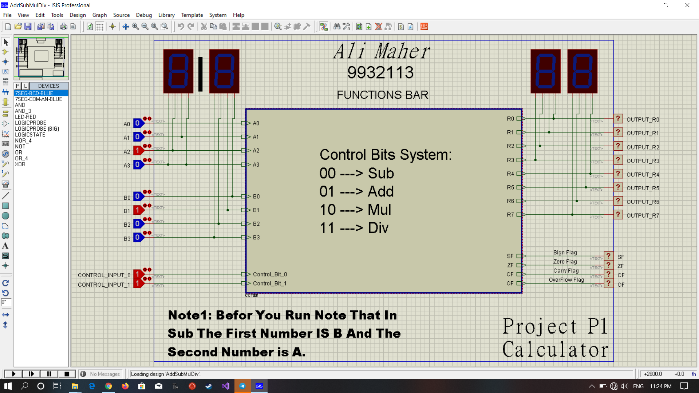
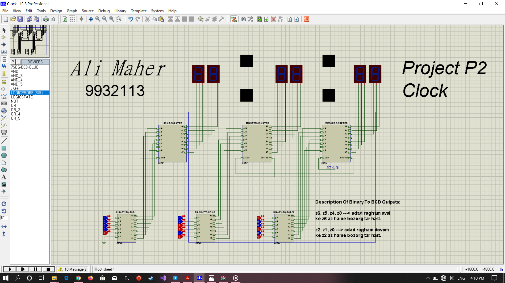
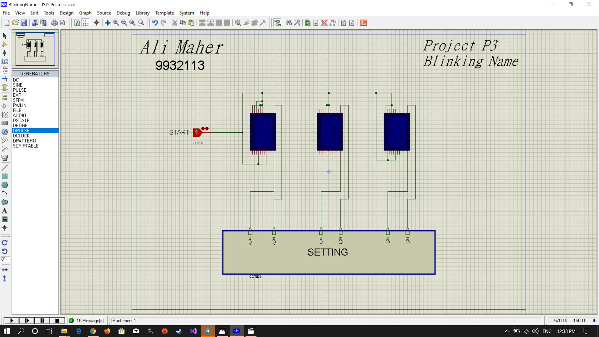

# Logic Circuits Lab

## Project Description

This project is a part of the Logic Circuits Lab course. The project consists of three parts:

### 1. Calculator (ALU - Arithmetic Logic Unit)

In this part, we implement a simple Arithmetic Logic Unit (ALU) that performs four common operations: Add, Subtract, Multiply, and Divide. The ALU takes two 4-bit numbers and a 2-bit mode input that identifies the desired operation. The numbers are assumed to be in 2’s complement form, except for the "divide" operation, where the numbers are treated as unsigned.

#### Inputs:
- A: 4-bit number (Operand A)
- B: 4-bit number (Operand B)
- Mode: 2-bit number (Operation mode: 00 for Add, 01 for Subtract, 10 for Multiply, 11 for Divide)

#### Outputs:
- Result: 8-bit number (Result of the operation, or multiplicand + remainder for "divide" operation)
- Flags:
    - Overflow: Set if the result overflows 8 bits
    - Carry: Set if there is a carry-out in addition or borrow in subtraction
    - Zero: Set if the result is zero
    - Negative: Set if the result is negative

### 2. Clock

Design a clock using six seven-segment displays. The clock can be set using binary inputs for hours, minutes, and seconds. For example, setting the hour input as 10010 should set the clock to 18 hours, and the clock will continue counting from there.

#### Inputs:
- Hour: 6-bit binary input for setting the hour
- Minute: 6-bit binary input for setting the minute
- Second: 6-bit binary input for setting the second

### 3. Name Block

In this part, we create a block that represents your name using different segments. At first, all segments are off, and after 5 seconds, the first letter of your name is shown. The sequence continues until all letters are on, and then your name will blink until the end of the day.

